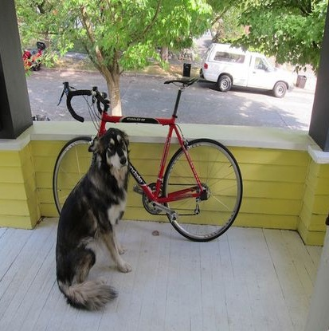
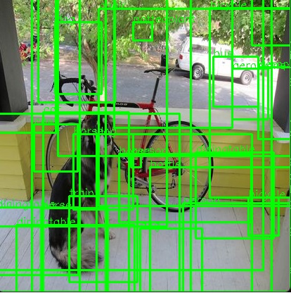

# Implémentation d'inférence de YOLOv2 avec TensorRT et ONNX

Ce projet avait pour but d'implémenter un algorithme de traitement d'image. L'inférence a été réalisée avec **TensorRT** en **C++**, et les résultats sont affichés à l'aide d'**OpenCV**. Le type de tâche réalisé par cet algorithme est de contourer des objets par des "bounding box" via l'algorithme tiny-YOLO-v2.

## Etapes du projet

- Configuration de l'environnement (cmake, CUDA, TensorRT, OpenCV)
- Utilisation d'un sample de TensorRT
- Intégration du modèle pré-entraîné YOLOv2
- Configuration des paramètres d'entrée dont l'image à traiter
- Récupération et manipulation des sorties de l'algorithme
- Affichage des résultats avec les boîtes englobantes (bounding boxes) autour des objets détectés


## Structure du projet

Le projet est organisé de cette manière :

- `yoloOnnx.cpp`: Fichier principal contenant le code d'inférence avec YOLOv2.
- `model/`: Contient le fichier tinyyolov2-8.onnx du modèle YOLOv2 au format ONNX.
- `data/images/`: Contient les images d'entrée et de sortie pour l'inférence.
- `yoloONNX.sln`: Fichier solution Visual Studio pour le projet.
  
## Prérequis

Pour exécuter ce projet, vous devez avoir installé les outils suivants :

- **TensorRT** : bibliothèque haute performance pour l'optimisation et le déploiement de réseaux de neurones profonds (DNN) principalement les GPU (NVIDIA) : https://developer.nvidia.com/tensorrt/download/10x
- **OpenCV** : bibliothèque libre, spécialisée dans le traitement d'images en temps réel dont dans notre cas pour l'affichage d'images : https://opencv.org/releases/
- **CUDA** : technologie propriétaire utilisant un processeur graphique (GPU) pour exécuter des calculs généraux à la place du processeur central (CPU) : https://developer.nvidia.com/cuda-downloads

## Compilation et Exécution

1. Clonez ce dépôt :

    ```bash
    git clone https://github.com/antoine-rb/yolov2-onnx.git
    ```

2. Allez dans le répertoire du projet visual studio :

    ```bash
    cd YOLO_V2_ONNX
    ```

3. Exécutez le programme :


    Lacer l'execution dans Visual Studio (ctrl + f5)


## Explications des sorties du modèle YOLOv2

La sortie du réseau de neurones YOLOV2 est un tenseur de dimensions (125x13x13), où 13x13 représente le nombre de cellules de la grille dans laquelle l'image est divisée. Chaque cellule de la grille correspond à 125 canaux, constitués de 5 bounding boxes prédites par la cellule et de 25 éléments de données décrivant chaque bounding box (5x25=125).

Les coordonnées des boîtes englobantes sont affinées à l'aide de transformations telles que la fonction sigmoïde sur `x` et `y`, et la fonction exponentielle sur `w` et `h`. Les valeurs sont ensuite multipliées par les ancres pour obtenir les dimensions finales des boîtes. 

## Images d'exemple

### Image de départ
Voici l'image d'entrée utilisée pour l'inférence.



### Image après inférence
Voici l'image après l'inférence réalisée avec le modèle YOLOv2, affichant les boîtes englobantes des objets détectés.



Actuellement, l'implémentation de l'inférence ne répond  pas au besoin de détection et de classification de par le nombre excessif de boîtes englobantes générées et des classifications incorrectes. 

Une première piste pour expliquer ce résultat non conforme est que les données d'ancrage ne seraient pas correctes. En effet, n'ayant pas eu accès aux données d'ancrage (anchors) spécifiques utilisées lors de l'entraînement de ce modèle, nous avons dû nous référer à des valeurs provenant d'un autre projet utilisant YOLOv2, qui ne correspondait pas exactement à notre modèle de données (Pascal VOC vs COCO).

Une deuxième piste pour résoudre cette problématique serait d'explorer plus en profondeur la littérature relative au traitement des sorties de YOLO, notamment les méthodes de post-traitement des résultats d'inférence (sigmoid, NMS, ancrage, softmax etc.)

## Sources

Voici les principales sources et références utilisées pour ce projet :

- [YOLO: Real-Time Object Detection](https://arxiv.org/pdf/1612.08242)
- [Netron:  visualisation des réseaux de neurones](https://netron.app/)
- [GitHub YOLOv2 ONNX](https://github.com/onnx/models/tree/main/validated/vision/object_detection_segmentation/tiny-yolov2)

